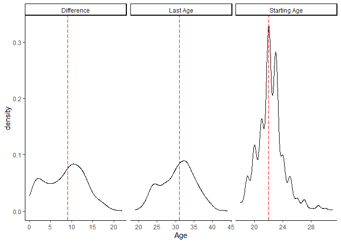
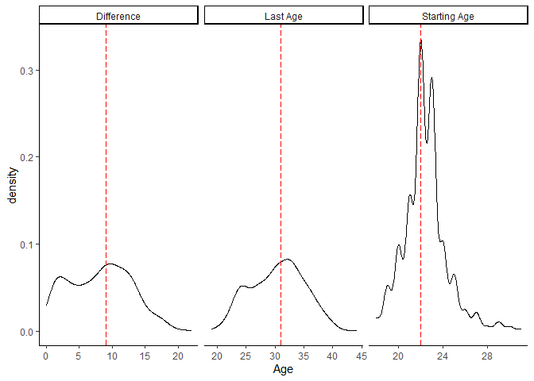
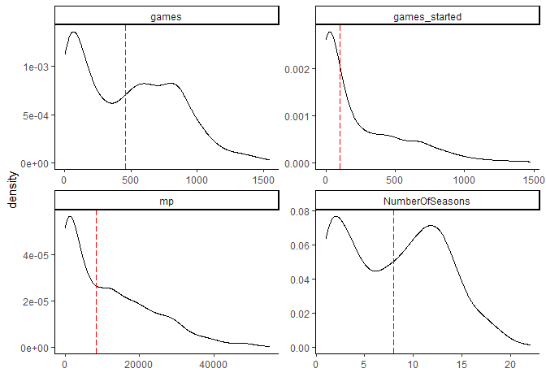
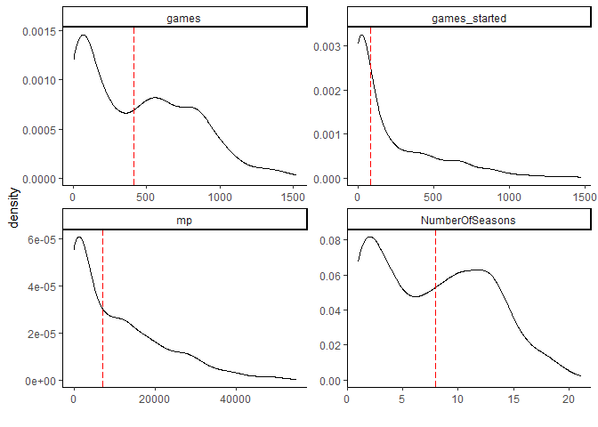

Average Length of NBA Careers
================

## Ballr

The `ballr` package provides easy to use function to access the vast
data resources on basketball-reference.com.

To get historical data for a defined group of players, we first pick a
few given seasons. For our example, we pick the 2003 to the 2010
seasons.

``` r
Per36 = purrr::map( as.list(seq(2003, 2010, 1)) , ~ NBAPerGameStatisticsPer36Min(season = .x) ) %>% 
  bind_rows(.)


PullLinksMissing = Per36 %>%
  select(player, link) %>% 
  filter(is.na(link)) %>% 
  distinct(player) %>% 
  tidyr::separate(player, into = c("First", "Last"), remove = FALSE ,sep = "[ ]") %>% 
  mutate_all(tolower) %>% 
  mutate_at(vars(Last) , ~ stringi::stri_replace_all_regex(.x, "[^[:alpha:]]", "")) %>% 
  mutate(newLink_a = paste0("players/" , stringi::stri_sub(Last, 1, 1) , "/", 
                          stringi::stri_sub(Last,1,5),
                          stringi::stri_sub(First, 1, 2))  ,
         newLink = dplyr::case_when(First == "ray" & Last == "allen" ~ paste0(newLink_a, "02.html" ), 
                             TRUE ~ paste0(newLink_a, "01.html")) ,
         FullURL = paste0("http://www.basketball-reference.com/", newLink))  %>% 
  rowwise() %>% 
  mutate(Exist = url.exists(FullURL)) %>% 
  ungroup() %>% 
  mutate(ShortenURL = stringi::stri_replace_all_fixed(FullURL, "http://www.basketball-reference.com", "")) %>% 
  mutate(PlayerInfo = purrr::map( ShortenURL,  NBAPlayerPerGameStats) ) %>% 
  select(player,link=ShortenURL, PlayerInfo)

dput(PullLinksMissing,"MissingPlayers")

PullLinksCompl = Per36 %>% 
  filter(!is.na(link)) %>%
  select(link, player) %>% 
  distinct(link, .keep_all = TRUE) %>% 
  mutate(PlayerInfo_a = purrr::map( link,  NBAPlayerPerGameStats) ,
         PlayerInfo = purrr::map(PlayerInfo_a , ~ .x %>% mutate_at(vars(-season, -tm, -lg, -pos), as.numeric)) )
```

The first step is to pull all player data for these years. We use the
function `NBAPerGameStatisticsPer36Min`, and only keep the distinct
player names and links. In the dataset, there is a variable called
`link`, which provides the link to that player on Basketball Reference.

Note, there are some players who do not have a link. After googling, and
using some intuition, I realized the players were all hall of famers.
The asterisks in the underlying data break the link function from the
`ballr` package.

To fix this, we use the `url.exists` function from the `RCurl` package
to recreate the URL. The link the function `NBAPlayerPerGameStats` is
basically the following:

  - players
  - the lowercase first letter of the last name
  - the first five letters of the last name
  - the first two letters of the first name
  - a digit which refers to whether a player who has the same name
    preceded that player. For instance, for Ray Allen, there was another
    Ray Allen. His digit is 02, while most other players have 01.

Finally, after getting our unique links for both players who have a
links, and players who do not, we pull the full career statistics for
all players from 2003 to 2010 using `NBAPlayerPerGameStats`.

There is one final data issue. The class of each of the columns
`NBAPlayerPerGameStats` pulls in is not consistent. Across the eight
datasets (2003 to 2010), the variable games or `g`, is classified as
both character and numeric. To resolve this final issue, we simply
define all variables as numeric with the exception of a few variables
prior to using the command `unnest`.

``` r
CompleteDataSet = bind_rows( PullLinksCompl , PullLinksMissing ) %>% 
  mutate(PlayerInfo2 = purrr::map(PlayerInfo , ~ .x %>% 
                                    mutate_at(vars(-season, -tm, -lg, -pos), as.numeric))) %>%
  select(-PlayerInfo) %>% 
  tidyr::unnest(PlayerInfo2)

dput(CompleteDataSet , "CompleteDataSet")
```

## Take a look at the data:

Now that we have the data, we can look at the average length of a
career, average minutes, among other variables that represent basketball
playing career.

There are 949 unique players in the dataset.

There are four variables that we could use to define length of career:

1.  Starting age to ending age.
2.  Number of games
3.  Number of minutes
4.  Number of seasons

We’ll show the distribution for each of these below:

## Starting Age:

The starting age to ending age shows the journey. A player like PJ
Tucker may have entered the league at age 21, but then did not play
again until the age of 27. He is now thriving at age 35. The duration of
his career includes seasons played in Europe. Basketball Reference data
does not capture that.

The first plot looks at the distribution of the three age metrics. The
dashed-red vertical line is the median value of each of the three
metrics. This plot includes active players, or more specifically,
players who have an entry for the 2019-2020 season.

<!-- -->

The second plot is the same, however, we remove active players.

<!-- -->

### Number of Minutes and Games Played

The number of games played is conceptually simple idea. However, it is
hard to differentiate between a player who had low minutes played
because of injuries, and a player who had low minutes played because of
poor performance.

<!-- -->

<!-- -->
