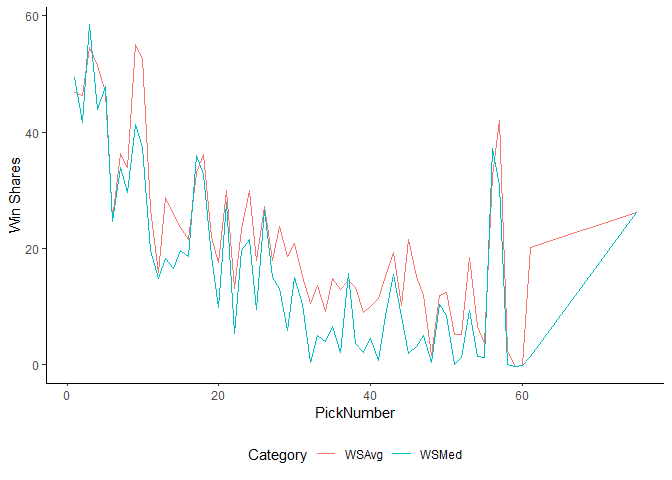
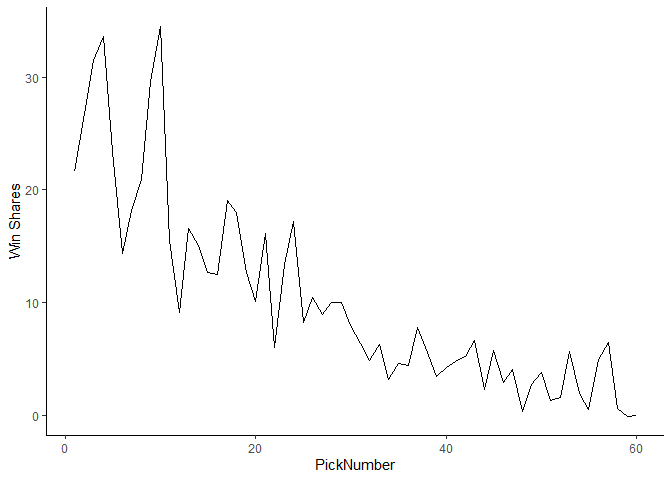
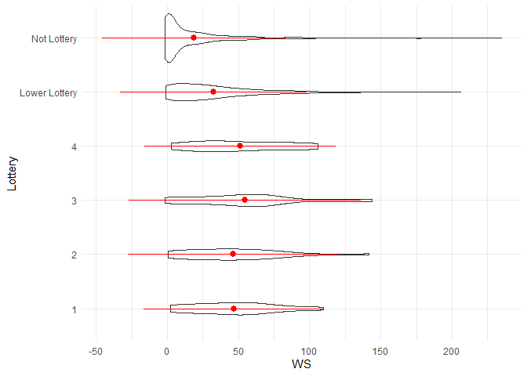

Getting Draft Data
================

## Getting draft data

An interesting aspect of evaluating average player length is looking at
their original draft position. The below code uses Basketball Reference
and `rvest` to pull the drafts from 1985 to 2010.

This post uses the two packages `rvest` and the `tidyverse` package.

The code below looks through the NBA draft pages on Basketball
Reference. It pulls the html tag table.

When the code reads in the data, the first few variables do not have
assigned variable names. To quickly fix this, we use the `janitor`
package, and the function `clean_names`. This gives each variable a
name, and allows us to manipulate the dataset.

``` r
DraftDataReadIn = tibble(DraftYear = seq(1984, 2010, 1)) %>% 
  mutate(URL = purrr::map(
    DraftYear, ~read_html( 
      paste0("https://www.basketball-reference.com/draft/NBA_", .x, ".html")) %>% 
      html_nodes("table") %>% 
      html_table() %>% 
      .[[1]]) )

DraftData = DraftDataReadIn %>% 
  mutate(DraftData = purrr::map(URL, ~.x %>% 
                                  janitor::clean_names() %>% 
                                  select(2:5) %>% 
           purrr::set_names(c("PickNumber", "Team", "PlayerName", "College")) %>% 
             filter(row_number() > 1))) %>%
  select(-URL) %>% 
  tidyr::unnest(DraftData)
```

Below is a table of how the data looks after the pull from Basketball
Reference with a few data steps. The table shows the top five picks from
the famous 1984 NBA draft.

<!--html_preserve-->

<style>html {
  font-family: -apple-system, BlinkMacSystemFont, 'Segoe UI', Roboto, Oxygen, Ubuntu, Cantarell, 'Helvetica Neue', 'Fira Sans', 'Droid Sans', Arial, sans-serif;
}

#nqvufmriio .gt_table {
  display: table;
  border-collapse: collapse;
  margin-left: auto;
  margin-right: auto;
  color: #333333;
  font-size: 16px;
  background-color: #FFFFFF;
  width: auto;
  border-top-style: solid;
  border-top-width: 2px;
  border-top-color: #A8A8A8;
  border-right-style: none;
  border-right-width: 2px;
  border-right-color: #D3D3D3;
  border-bottom-style: solid;
  border-bottom-width: 2px;
  border-bottom-color: #A8A8A8;
  border-left-style: none;
  border-left-width: 2px;
  border-left-color: #D3D3D3;
}

#nqvufmriio .gt_heading {
  background-color: #FFFFFF;
  text-align: center;
  border-bottom-color: #FFFFFF;
  border-left-style: none;
  border-left-width: 1px;
  border-left-color: #D3D3D3;
  border-right-style: none;
  border-right-width: 1px;
  border-right-color: #D3D3D3;
}

#nqvufmriio .gt_title {
  color: #333333;
  font-size: 125%;
  font-weight: initial;
  padding-top: 4px;
  padding-bottom: 4px;
  border-bottom-color: #FFFFFF;
  border-bottom-width: 0;
}

#nqvufmriio .gt_subtitle {
  color: #333333;
  font-size: 85%;
  font-weight: initial;
  padding-top: 0;
  padding-bottom: 4px;
  border-top-color: #FFFFFF;
  border-top-width: 0;
}

#nqvufmriio .gt_bottom_border {
  border-bottom-style: solid;
  border-bottom-width: 2px;
  border-bottom-color: #D3D3D3;
}

#nqvufmriio .gt_col_headings {
  border-top-style: solid;
  border-top-width: 2px;
  border-top-color: #D3D3D3;
  border-bottom-style: solid;
  border-bottom-width: 2px;
  border-bottom-color: #D3D3D3;
  border-left-style: none;
  border-left-width: 1px;
  border-left-color: #D3D3D3;
  border-right-style: none;
  border-right-width: 1px;
  border-right-color: #D3D3D3;
}

#nqvufmriio .gt_col_heading {
  color: #333333;
  background-color: #FFFFFF;
  font-size: 100%;
  font-weight: normal;
  text-transform: inherit;
  border-left-style: none;
  border-left-width: 1px;
  border-left-color: #D3D3D3;
  border-right-style: none;
  border-right-width: 1px;
  border-right-color: #D3D3D3;
  vertical-align: bottom;
  padding-top: 5px;
  padding-bottom: 6px;
  padding-left: 5px;
  padding-right: 5px;
  overflow-x: hidden;
}

#nqvufmriio .gt_column_spanner_outer {
  color: #333333;
  background-color: #FFFFFF;
  font-size: 100%;
  font-weight: normal;
  text-transform: inherit;
  padding-top: 0;
  padding-bottom: 0;
  padding-left: 4px;
  padding-right: 4px;
}

#nqvufmriio .gt_column_spanner_outer:first-child {
  padding-left: 0;
}

#nqvufmriio .gt_column_spanner_outer:last-child {
  padding-right: 0;
}

#nqvufmriio .gt_column_spanner {
  border-bottom-style: solid;
  border-bottom-width: 2px;
  border-bottom-color: #D3D3D3;
  vertical-align: bottom;
  padding-top: 5px;
  padding-bottom: 6px;
  overflow-x: hidden;
  display: inline-block;
  width: 100%;
}

#nqvufmriio .gt_group_heading {
  padding: 8px;
  color: #333333;
  background-color: #FFFFFF;
  font-size: 100%;
  font-weight: initial;
  text-transform: inherit;
  border-top-style: solid;
  border-top-width: 2px;
  border-top-color: #D3D3D3;
  border-bottom-style: solid;
  border-bottom-width: 2px;
  border-bottom-color: #D3D3D3;
  border-left-style: none;
  border-left-width: 1px;
  border-left-color: #D3D3D3;
  border-right-style: none;
  border-right-width: 1px;
  border-right-color: #D3D3D3;
  vertical-align: middle;
}

#nqvufmriio .gt_empty_group_heading {
  padding: 0.5px;
  color: #333333;
  background-color: #FFFFFF;
  font-size: 100%;
  font-weight: initial;
  border-top-style: solid;
  border-top-width: 2px;
  border-top-color: #D3D3D3;
  border-bottom-style: solid;
  border-bottom-width: 2px;
  border-bottom-color: #D3D3D3;
  vertical-align: middle;
}

#nqvufmriio .gt_striped {
  background-color: rgba(128, 128, 128, 0.05);
}

#nqvufmriio .gt_from_md > :first-child {
  margin-top: 0;
}

#nqvufmriio .gt_from_md > :last-child {
  margin-bottom: 0;
}

#nqvufmriio .gt_row {
  padding-top: 8px;
  padding-bottom: 8px;
  padding-left: 5px;
  padding-right: 5px;
  margin: 10px;
  border-top-style: solid;
  border-top-width: 1px;
  border-top-color: #D3D3D3;
  border-left-style: none;
  border-left-width: 1px;
  border-left-color: #D3D3D3;
  border-right-style: none;
  border-right-width: 1px;
  border-right-color: #D3D3D3;
  vertical-align: middle;
  overflow-x: hidden;
}

#nqvufmriio .gt_stub {
  color: #333333;
  background-color: #FFFFFF;
  font-size: 100%;
  font-weight: initial;
  text-transform: inherit;
  border-right-style: solid;
  border-right-width: 2px;
  border-right-color: #D3D3D3;
  padding-left: 12px;
}

#nqvufmriio .gt_summary_row {
  color: #333333;
  background-color: #FFFFFF;
  text-transform: inherit;
  padding-top: 8px;
  padding-bottom: 8px;
  padding-left: 5px;
  padding-right: 5px;
}

#nqvufmriio .gt_first_summary_row {
  padding-top: 8px;
  padding-bottom: 8px;
  padding-left: 5px;
  padding-right: 5px;
  border-top-style: solid;
  border-top-width: 2px;
  border-top-color: #D3D3D3;
}

#nqvufmriio .gt_grand_summary_row {
  color: #333333;
  background-color: #FFFFFF;
  text-transform: inherit;
  padding-top: 8px;
  padding-bottom: 8px;
  padding-left: 5px;
  padding-right: 5px;
}

#nqvufmriio .gt_first_grand_summary_row {
  padding-top: 8px;
  padding-bottom: 8px;
  padding-left: 5px;
  padding-right: 5px;
  border-top-style: double;
  border-top-width: 6px;
  border-top-color: #D3D3D3;
}

#nqvufmriio .gt_table_body {
  border-top-style: solid;
  border-top-width: 2px;
  border-top-color: #D3D3D3;
  border-bottom-style: solid;
  border-bottom-width: 2px;
  border-bottom-color: #D3D3D3;
}

#nqvufmriio .gt_footnotes {
  color: #333333;
  background-color: #FFFFFF;
  border-bottom-style: none;
  border-bottom-width: 2px;
  border-bottom-color: #D3D3D3;
  border-left-style: none;
  border-left-width: 2px;
  border-left-color: #D3D3D3;
  border-right-style: none;
  border-right-width: 2px;
  border-right-color: #D3D3D3;
}

#nqvufmriio .gt_footnote {
  margin: 0px;
  font-size: 90%;
  padding: 4px;
}

#nqvufmriio .gt_sourcenotes {
  color: #333333;
  background-color: #FFFFFF;
  border-bottom-style: none;
  border-bottom-width: 2px;
  border-bottom-color: #D3D3D3;
  border-left-style: none;
  border-left-width: 2px;
  border-left-color: #D3D3D3;
  border-right-style: none;
  border-right-width: 2px;
  border-right-color: #D3D3D3;
}

#nqvufmriio .gt_sourcenote {
  font-size: 90%;
  padding: 4px;
}

#nqvufmriio .gt_left {
  text-align: left;
}

#nqvufmriio .gt_center {
  text-align: center;
}

#nqvufmriio .gt_right {
  text-align: right;
  font-variant-numeric: tabular-nums;
}

#nqvufmriio .gt_font_normal {
  font-weight: normal;
}

#nqvufmriio .gt_font_bold {
  font-weight: bold;
}

#nqvufmriio .gt_font_italic {
  font-style: italic;
}

#nqvufmriio .gt_super {
  font-size: 65%;
}

#nqvufmriio .gt_footnote_marks {
  font-style: italic;
  font-size: 65%;
}
</style>

<div id="nqvufmriio" style="overflow-x:auto;overflow-y:auto;width:auto;height:auto;">

<table class="gt_table">

<thead class="gt_header">

<tr>

<th colspan="5" class="gt_heading gt_title gt_font_normal" style>

Top ten 1984 draft picks

</th>

</tr>

<tr>

<th colspan="5" class="gt_heading gt_subtitle gt_font_normal gt_bottom_border" style>

</th>

</tr>

</thead>

<thead class="gt_col_headings">

<tr>

<th class="gt_col_heading gt_columns_bottom_border gt_right" rowspan="1" colspan="1">

DraftYear

</th>

<th class="gt_col_heading gt_columns_bottom_border gt_left" rowspan="1" colspan="1">

PickNumber

</th>

<th class="gt_col_heading gt_columns_bottom_border gt_left" rowspan="1" colspan="1">

Team

</th>

<th class="gt_col_heading gt_columns_bottom_border gt_left" rowspan="1" colspan="1">

PlayerName

</th>

<th class="gt_col_heading gt_columns_bottom_border gt_left" rowspan="1" colspan="1">

College

</th>

</tr>

</thead>

<tbody class="gt_table_body">

<tr>

<td class="gt_row gt_right">

1984

</td>

<td class="gt_row gt_left">

1

</td>

<td class="gt_row gt_left">

HOU

</td>

<td class="gt_row gt_left">

Hakeem Olajuwon

</td>

<td class="gt_row gt_left">

Houston

</td>

</tr>

<tr>

<td class="gt_row gt_right">

1984

</td>

<td class="gt_row gt_left">

2

</td>

<td class="gt_row gt_left">

POR

</td>

<td class="gt_row gt_left">

Sam Bowie

</td>

<td class="gt_row gt_left">

Kentucky

</td>

</tr>

<tr>

<td class="gt_row gt_right">

1984

</td>

<td class="gt_row gt_left">

3

</td>

<td class="gt_row gt_left">

CHI

</td>

<td class="gt_row gt_left">

Michael Jordan

</td>

<td class="gt_row gt_left">

UNC

</td>

</tr>

<tr>

<td class="gt_row gt_right">

1984

</td>

<td class="gt_row gt_left">

4

</td>

<td class="gt_row gt_left">

DAL

</td>

<td class="gt_row gt_left">

Sam Perkins

</td>

<td class="gt_row gt_left">

UNC

</td>

</tr>

<tr>

<td class="gt_row gt_right">

1984

</td>

<td class="gt_row gt_left">

5

</td>

<td class="gt_row gt_left">

PHI

</td>

<td class="gt_row gt_left">

Charles Barkley

</td>

<td class="gt_row gt_left">

Auburn

</td>

</tr>

<tr>

<td class="gt_row gt_right">

1984

</td>

<td class="gt_row gt_left">

6

</td>

<td class="gt_row gt_left">

WSB

</td>

<td class="gt_row gt_left">

Melvin Turpin

</td>

<td class="gt_row gt_left">

Kentucky

</td>

</tr>

</tbody>

</table>

</div>

<!--/html_preserve-->

## Working with the draft data

The podcast the [NBA
redraftables](https://www.theringer.com/book-of-basketball) frequently
mention the Win Shares per pick, or per draft. As an example, we can use
the 26 drafts pulled from above to see the most valuable picks based on
Basketball Reference’s Win Shares and Player Efficiency Rating (PER).

To get these data, we again have to use the `rvest` package. While the
code is not significantly more verbose, it is a little more challenging.
The `html_nodes` function pulls the `div` tag. The `html_text` function
removes all of the html from the pull, leaving just the text. This
allows us to find the Win Share and PER values from the Basketball
Reference.

``` r
AllPlayers = dget("Data/CompleteDataSet") 

AllDistinctPlayers = AllPlayers %>%
  distinct(link) %>% 
  mutate(GetPERWS = purrr::map(link, ~read_html( 
      paste0("https://www.basketball-reference.com" , .x))  %>% 
      html_nodes("div div") %>%
  html_text() %>% 
  as_tibble()  %>% 
  filter(grepl("\nPER", value) == TRUE | grepl("\nWS", value) == TRUE) %>%
    mutate(VarNm = stringi::stri_replace_all_regex(value, "[^[A-Z]]", ""),
         Number = gsub("\n|PER|WS", "", value)) %>% 
  filter(VarNm %in% c("PER", "WS")) %>% 
  select(-value) %>% 
  tidyr::spread(VarNm, Number))) %>% 
  tidyr::unnest(GetPERWS)
```

The plot below shows the Win Shares by pick number. Unfortunately, as
you get further down the draft, there are fewer players that even make
the NBA. Pick number 57 is a perfect example. There are only five picks
from 1984 to 2010 that made the NBA, and were still playing between 2003
and 2010. Manu Ginobli is an elite player picked number 57. The average
is not actually reflective of the impact of the 57 pick.

<!-- -->

We can normalize this by just dividing the sum of Win Shares by the
number of years of drafts. In this case, we looked at 26 drafts. We can
divide the sum of win shares by pick number by 26. It is important to
note that there is no pick number where there are 26 picks at the number
are still in the league. For instance, there are 15 number one picks
from 1984 to 2010 which played at least one season in the league between
2003 and 2010.

<!-- -->

Finally, a violin plot shows the distribution of Win Shares by pick:

<!-- -->

Overall, the top four picks have a similar mean. The third pick overall
has the highest mean, but the fourth pick seems to have a greater share
of its distribution further to the right of the Win Share axis. The
lower lottery, and non-lottery picks have both lower means, and a
greater share of their distribution near zero Win Shares.
