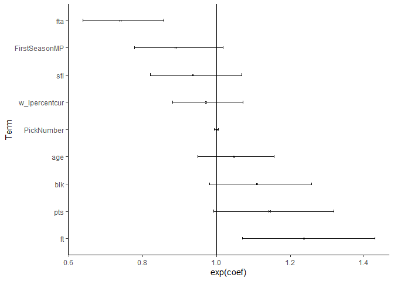

Survival Analysis
================

The two previous posts have described the data available. This post will
look to survival analysis to assess time until the end of a NBA career.

The first plot looks at the Kaplan Meier curves for both minutes played
and seasons played by position.

As we can see, there is not a considerable difference between positions
for the minutes played Kaplan-Meier curve.

<!-- -->

Next, we look at the seasons played:

<!-- -->

The green and blue curves are higher than the other three curves. This
suggests that players classified as small forward, and point guard have
longer careers.

While both metrics are interesting, minutes played better describes a
players career arc. The following analysis will look at minutes played.

## Cox Proportional Hazard:

The next step is to develop a regression model. We model hazard ratios.

With Basketball-Reference, there are basically infinite combinations of
models we could consider. One method of to develop this model could be
to put all the possible factors that influence time until retirement,
and use a lasso regression to determine which variables are best.
However, there are problems with consistency with lasso regressions, see
[here](https://stats.stackexchange.com/questions/348320/consistency-of-lasso):

Finally, we could use institutional knowledge. Institutional knowledge
of how the Data Generated Process works allows us to use knowledge in an
area to model a process. In this case, we understand that players who
are better, get longer contracts, and can usually play longer as their
skills atrophy.

## Data

To model minutes, we will do so based on the players first season. We
are not interested in how a given player performs in their fifth year,
but rather, based on the first season in the NBA, what is the players
expected career length as defined by minutes played. Minutes played is a
good benchmark for both contracts, but also accounts for skill atrophy
within a contract.

The variables of interest will be player statistics after their first
year. We will consider both traditional statistics like points, assists,
and rebounds, and more modern statistics like expected field goal
percentage. A previous post showed how to pull draft position. We will
also use draft position. Finally, we will test whether the first team a
player plays on influences the length of their career.

After pulling each of the players season, we standardize all numeric
variables. Andrew Gelman has a post about this \[here\]
(<https://statmodeling.stat.columbia.edu/2009/07/11/when_to_standar/>).
In short, when comparing predictors within models, it is very useful to
standardize the predictor variables as it allows us to look to see which
predictors are the most predictive. To standardize variables in `R`, we
use the function `scale`.

## Lasso method:

To run the `glmnet` function, we need to create a matrix. We need the
categorical variables to be dummies.

The plot below shows the lambda on the x-axis, and the partial
likelihood deviance on the y axis. The goal is to minimize the partial
likelihood deviance.

<!-- -->

As an exercise, the below code shows how to reproduce the above plot
with `ggplot`.

``` r
tibble(Likelihood = LassoReg$cvup,
       Lambda= LassoReg$lambda ) %>% 
  mutate(LogLambda = round( log(Lambda) , digits = 0)) %>% 
  ggplot(., aes(x = LogLambda, y = Likelihood)) +
  geom_smooth() +
  theme_classic() +
  geom_vline(xintercept =  log(LassoReg$lambda.min)) +
  labs(x = expression("Log"~(lambda)) ,
                     y = "Partial Likelihood Deviance") 
```

<!-- -->

The minimum value of lambda is 0.0379598.

## Using Institutional Knowledge

Institutional knowledge models use expertise and literature to develop a
model. In this case, we will use expertise from NBA experts to develop a
model.

The model will use the following predictors:

1.  Age - the younger a player, the longer they have to develop, and the
    longer their peak performance may be.  
2.  Five year average of win-loss rate of first team. The theory is that
    better teams are more sound decision makers.
3.  Free throw percentages: a free throw percentage is a very good
    predictor for young players, as it shows their innate shooting
    skills.
4.  Free throw attempts: players who are able to get free throws can
    generate efficient offense.
5.  Effective Field Goal Percent: This just shows how efficient a
    basketball player is.
6.  Draft position – the higher a draft position, the better a given
    player is perceived to be by experts.
7.  Blocks and steals are very crude metric of defensive ability. f
8.  Points - simply because players with more points may be able to play
    longer because of reputation.

The team was excluded from this analysis. Team management changes over
time, and the 5-year moving average of their win percentage is a better
reflection of the organization of the team, then just the dummy variable
of team.

## Proportional Hazard Assumption

A key assumption in a Cox Proportional Hazard model is that that the
proportional. This assumption simply states that the ratio of hazards
must be constant over time. To check whether this assumption hols, we do
two things:

1.  Check whether the interaction between time (minutes in our case) and
    the predictors are statistically significant.

For the Lasso model, there are two predictors which do not meet the
proportional hazard assumption:

For the institutional model, there are three predictors which do not
meet the proportional hazard assumptions.

<!--html_preserve-->

<style>html {
  font-family: -apple-system, BlinkMacSystemFont, 'Segoe UI', Roboto, Oxygen, Ubuntu, Cantarell, 'Helvetica Neue', 'Fira Sans', 'Droid Sans', Arial, sans-serif;
}

#dhddmcqlok .gt_table {
  display: table;
  border-collapse: collapse;
  margin-left: auto;
  margin-right: auto;
  color: #333333;
  font-size: 16px;
  background-color: #FFFFFF;
  width: auto;
  border-top-style: solid;
  border-top-width: 2px;
  border-top-color: #A8A8A8;
  border-right-style: none;
  border-right-width: 2px;
  border-right-color: #D3D3D3;
  border-bottom-style: solid;
  border-bottom-width: 2px;
  border-bottom-color: #A8A8A8;
  border-left-style: none;
  border-left-width: 2px;
  border-left-color: #D3D3D3;
}

#dhddmcqlok .gt_heading {
  background-color: #FFFFFF;
  text-align: center;
  border-bottom-color: #FFFFFF;
  border-left-style: none;
  border-left-width: 1px;
  border-left-color: #D3D3D3;
  border-right-style: none;
  border-right-width: 1px;
  border-right-color: #D3D3D3;
}

#dhddmcqlok .gt_title {
  color: #333333;
  font-size: 125%;
  font-weight: initial;
  padding-top: 4px;
  padding-bottom: 4px;
  border-bottom-color: #FFFFFF;
  border-bottom-width: 0;
}

#dhddmcqlok .gt_subtitle {
  color: #333333;
  font-size: 85%;
  font-weight: initial;
  padding-top: 0;
  padding-bottom: 4px;
  border-top-color: #FFFFFF;
  border-top-width: 0;
}

#dhddmcqlok .gt_bottom_border {
  border-bottom-style: solid;
  border-bottom-width: 2px;
  border-bottom-color: #D3D3D3;
}

#dhddmcqlok .gt_col_headings {
  border-top-style: solid;
  border-top-width: 2px;
  border-top-color: #D3D3D3;
  border-bottom-style: solid;
  border-bottom-width: 2px;
  border-bottom-color: #D3D3D3;
  border-left-style: none;
  border-left-width: 1px;
  border-left-color: #D3D3D3;
  border-right-style: none;
  border-right-width: 1px;
  border-right-color: #D3D3D3;
}

#dhddmcqlok .gt_col_heading {
  color: #333333;
  background-color: #FFFFFF;
  font-size: 100%;
  font-weight: normal;
  text-transform: inherit;
  border-left-style: none;
  border-left-width: 1px;
  border-left-color: #D3D3D3;
  border-right-style: none;
  border-right-width: 1px;
  border-right-color: #D3D3D3;
  vertical-align: bottom;
  padding-top: 5px;
  padding-bottom: 6px;
  padding-left: 5px;
  padding-right: 5px;
  overflow-x: hidden;
}

#dhddmcqlok .gt_column_spanner_outer {
  color: #333333;
  background-color: #FFFFFF;
  font-size: 100%;
  font-weight: normal;
  text-transform: inherit;
  padding-top: 0;
  padding-bottom: 0;
  padding-left: 4px;
  padding-right: 4px;
}

#dhddmcqlok .gt_column_spanner_outer:first-child {
  padding-left: 0;
}

#dhddmcqlok .gt_column_spanner_outer:last-child {
  padding-right: 0;
}

#dhddmcqlok .gt_column_spanner {
  border-bottom-style: solid;
  border-bottom-width: 2px;
  border-bottom-color: #D3D3D3;
  vertical-align: bottom;
  padding-top: 5px;
  padding-bottom: 6px;
  overflow-x: hidden;
  display: inline-block;
  width: 100%;
}

#dhddmcqlok .gt_group_heading {
  padding: 8px;
  color: #333333;
  background-color: #FFFFFF;
  font-size: 100%;
  font-weight: initial;
  text-transform: inherit;
  border-top-style: solid;
  border-top-width: 2px;
  border-top-color: #D3D3D3;
  border-bottom-style: solid;
  border-bottom-width: 2px;
  border-bottom-color: #D3D3D3;
  border-left-style: none;
  border-left-width: 1px;
  border-left-color: #D3D3D3;
  border-right-style: none;
  border-right-width: 1px;
  border-right-color: #D3D3D3;
  vertical-align: middle;
}

#dhddmcqlok .gt_empty_group_heading {
  padding: 0.5px;
  color: #333333;
  background-color: #FFFFFF;
  font-size: 100%;
  font-weight: initial;
  border-top-style: solid;
  border-top-width: 2px;
  border-top-color: #D3D3D3;
  border-bottom-style: solid;
  border-bottom-width: 2px;
  border-bottom-color: #D3D3D3;
  vertical-align: middle;
}

#dhddmcqlok .gt_striped {
  background-color: rgba(128, 128, 128, 0.05);
}

#dhddmcqlok .gt_from_md > :first-child {
  margin-top: 0;
}

#dhddmcqlok .gt_from_md > :last-child {
  margin-bottom: 0;
}

#dhddmcqlok .gt_row {
  padding-top: 8px;
  padding-bottom: 8px;
  padding-left: 5px;
  padding-right: 5px;
  margin: 10px;
  border-top-style: solid;
  border-top-width: 1px;
  border-top-color: #D3D3D3;
  border-left-style: none;
  border-left-width: 1px;
  border-left-color: #D3D3D3;
  border-right-style: none;
  border-right-width: 1px;
  border-right-color: #D3D3D3;
  vertical-align: middle;
  overflow-x: hidden;
}

#dhddmcqlok .gt_stub {
  color: #333333;
  background-color: #FFFFFF;
  font-size: 100%;
  font-weight: initial;
  text-transform: inherit;
  border-right-style: solid;
  border-right-width: 2px;
  border-right-color: #D3D3D3;
  padding-left: 12px;
}

#dhddmcqlok .gt_summary_row {
  color: #333333;
  background-color: #FFFFFF;
  text-transform: inherit;
  padding-top: 8px;
  padding-bottom: 8px;
  padding-left: 5px;
  padding-right: 5px;
}

#dhddmcqlok .gt_first_summary_row {
  padding-top: 8px;
  padding-bottom: 8px;
  padding-left: 5px;
  padding-right: 5px;
  border-top-style: solid;
  border-top-width: 2px;
  border-top-color: #D3D3D3;
}

#dhddmcqlok .gt_grand_summary_row {
  color: #333333;
  background-color: #FFFFFF;
  text-transform: inherit;
  padding-top: 8px;
  padding-bottom: 8px;
  padding-left: 5px;
  padding-right: 5px;
}

#dhddmcqlok .gt_first_grand_summary_row {
  padding-top: 8px;
  padding-bottom: 8px;
  padding-left: 5px;
  padding-right: 5px;
  border-top-style: double;
  border-top-width: 6px;
  border-top-color: #D3D3D3;
}

#dhddmcqlok .gt_table_body {
  border-top-style: solid;
  border-top-width: 2px;
  border-top-color: #D3D3D3;
  border-bottom-style: solid;
  border-bottom-width: 2px;
  border-bottom-color: #D3D3D3;
}

#dhddmcqlok .gt_footnotes {
  color: #333333;
  background-color: #FFFFFF;
  border-bottom-style: none;
  border-bottom-width: 2px;
  border-bottom-color: #D3D3D3;
  border-left-style: none;
  border-left-width: 2px;
  border-left-color: #D3D3D3;
  border-right-style: none;
  border-right-width: 2px;
  border-right-color: #D3D3D3;
}

#dhddmcqlok .gt_footnote {
  margin: 0px;
  font-size: 90%;
  padding: 4px;
}

#dhddmcqlok .gt_sourcenotes {
  color: #333333;
  background-color: #FFFFFF;
  border-bottom-style: none;
  border-bottom-width: 2px;
  border-bottom-color: #D3D3D3;
  border-left-style: none;
  border-left-width: 2px;
  border-left-color: #D3D3D3;
  border-right-style: none;
  border-right-width: 2px;
  border-right-color: #D3D3D3;
}

#dhddmcqlok .gt_sourcenote {
  font-size: 90%;
  padding: 4px;
}

#dhddmcqlok .gt_left {
  text-align: left;
}

#dhddmcqlok .gt_center {
  text-align: center;
}

#dhddmcqlok .gt_right {
  text-align: right;
  font-variant-numeric: tabular-nums;
}

#dhddmcqlok .gt_font_normal {
  font-weight: normal;
}

#dhddmcqlok .gt_font_bold {
  font-weight: bold;
}

#dhddmcqlok .gt_font_italic {
  font-style: italic;
}

#dhddmcqlok .gt_super {
  font-size: 65%;
}

#dhddmcqlok .gt_footnote_marks {
  font-style: italic;
  font-size: 65%;
}
</style>

<div id="dhddmcqlok" style="overflow-x:auto;overflow-y:auto;width:auto;height:auto;">

<table class="gt_table">

<thead class="gt_header">

<tr>

<th colspan="3" class="gt_heading gt_title gt_font_normal" style>

Proportional Hazard Table

</th>

</tr>

<tr>

<th colspan="3" class="gt_heading gt_subtitle gt_font_normal gt_bottom_border" style>

</th>

</tr>

</thead>

<thead class="gt_col_headings">

<tr>

<th class="gt_col_heading gt_center gt_columns_bottom_border" rowspan="2" colspan="1">

term

</th>

<th class="gt_center gt_columns_top_border gt_column_spanner_outer" rowspan="1" colspan="2">

<span class="gt_column_spanner">Model</span>

</th>

</tr>

<tr>

<th class="gt_col_heading gt_columns_bottom_border gt_center" rowspan="1" colspan="1">

Institutional

</th>

<th class="gt_col_heading gt_columns_bottom_border gt_center" rowspan="1" colspan="1">

Lasso

</th>

</tr>

</thead>

<tbody class="gt_table_body">

<tr>

<td class="gt_row gt_left">

mp:blk

</td>

<td class="gt_row gt_left">

\-1e-05 (0.01808871)

</td>

<td class="gt_row gt_left">

\-

</td>

</tr>

<tr>

<td class="gt_row gt_left">

mp:FirstSeasonMP

</td>

<td class="gt_row gt_left">

\-

</td>

<td class="gt_row gt_left">

2e-05 (0.00014616)

</td>

</tr>

<tr>

<td class="gt_row gt_left">

mp:ft

</td>

<td class="gt_row gt_left">

\-3e-05 (\< 2.22e-16)

</td>

<td class="gt_row gt_left">

\-

</td>

</tr>

<tr>

<td class="gt_row gt_left">

mp:fta

</td>

<td class="gt_row gt_left">

3e-05 (\< 2.22e-16)

</td>

<td class="gt_row gt_left">

1e-05 (0.03038708)

</td>

</tr>

<tr>

<td class="gt_row gt_left">

mp:trb

</td>

<td class="gt_row gt_left">

\-

</td>

<td class="gt_row gt_left">

\-2e-05 (7.2126e-05)

</td>

</tr>

</tbody>

</table>

</div>

<!--/html_preserve-->

2.  Show the model’s Schoenfeld residuals plotted against time, or in
    this case, minutes played.

<!-- -->

The above plot shows the Schoenfeld residuals against time for the Lasso
model, and below is the plot shows the Schoenfeld residuals against time
for the Institutional model.

<!-- -->

## Picking a model:

Survival models do not have provide a prediction the same way a logistic
model. Comparing models based on prediction accuracy is not as viable.

There is no perfect model to evaluate survival models. To evaluate the
two models, we will follow this
[post](https://stats.stackexchange.com/questions/254873/comparing-cox-proportional-hazards-models-aic).
We will take 100 bootstraps, and calculate the AIC for each of the
models. We then compare the median AIC for both models based on the 100
bootstraps.

Below is the plot of the 100 bootstraps. As we can see, the
institutional model has a lower mean AIC value. Based on this limited
exercise, this shows the value even limited knowledge of a field can
have in model selection.

<!-- -->

## Final Model

The hazard ratios, and their confidence intervals an be found below:

<!-- -->

There are only two terms where the 95% confidence intervals do not
include one.

First, an increase of one standard deviations of free throws is
associated with a 24% increase in minutes played after adjusting for the
other predictors.

Second, an increase of on standard deviations of free throw attempts is
associated with a 26% decrease in minutes played after adjusting for
other predictors.

## Limitations:

This is obviously a short blog post on this topic. There is no
information on contracts, player earnings, injuries, all of which are
much clearer determinants of minutes played in a career than any of the
predictors used.

Furthermore, this is not a predictive model. This model is a descriptive
model which attempts to understand what factors best explain why players
who played during the era of 2003 to 2010 played as many minutes as they
did over the course of their career.
